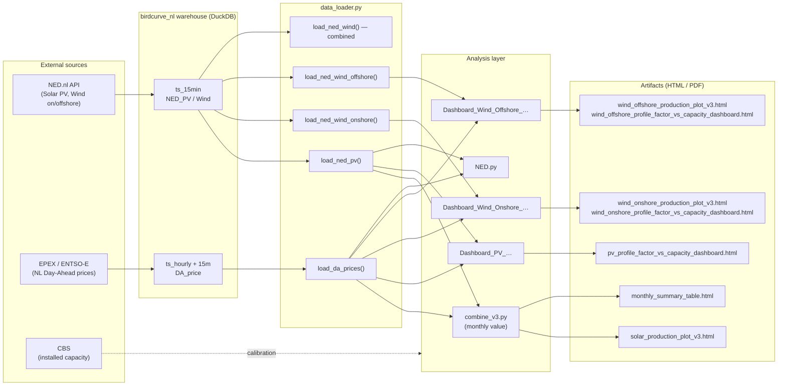
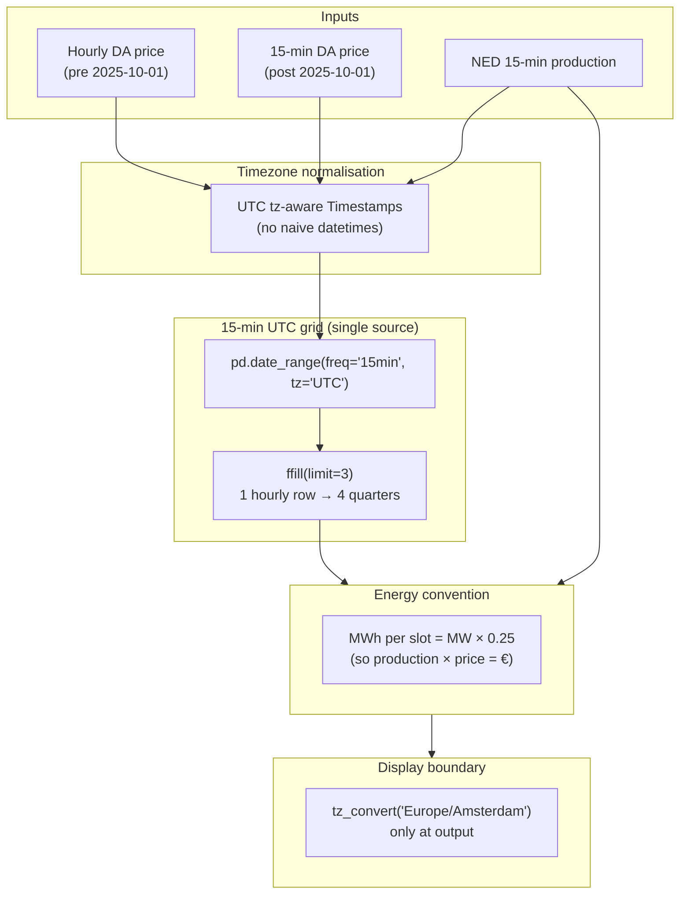
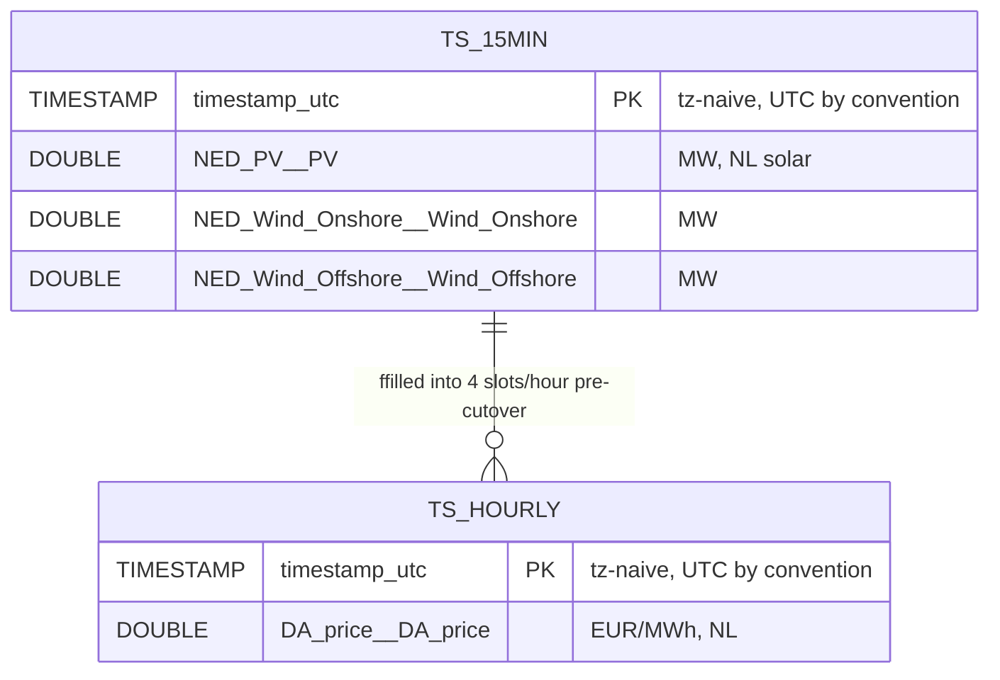
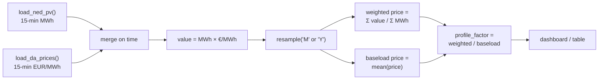
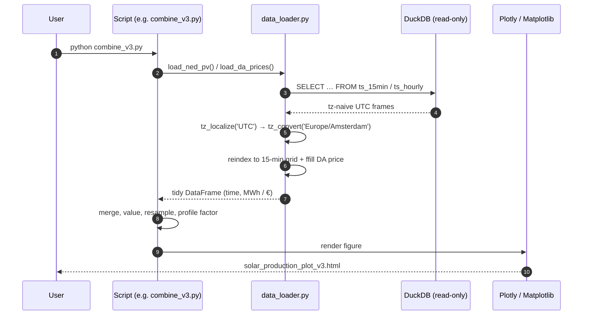
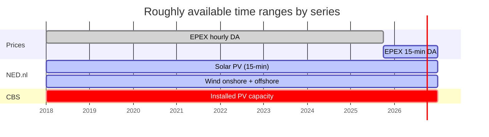

# Solar DA Value Analysis — NL

Quantifies the **market value of Dutch solar PV (and wind) production** by combining EPEX day-ahead spot prices with NED.nl generation data on a uniform 15-minute UTC grid. Outputs interactive Plotly dashboards, profile-factor vs. installed-capacity curves, and monthly summary tables.

> **Source of truth:** `birdcurve_nl` DuckDB warehouse — not raw CSV. The CSV ingestion path is archived but kept readable for forensic/historical use.

---

## 1. System overview



---

## 2. Repository map

```mermaid
graph TD
    classDef entry fill:#0d6efd,color:#fff,stroke:#0d6efd
    classDef lib fill:#198754,color:#fff,stroke:#198754
    classDef arch fill:#6c757d,color:#fff,stroke:#6c757d
    classDef out fill:#fd7e14,color:#fff,stroke:#fd7e14

    DL["data_loader.py<br/><i>shared loaders</i>"]:::lib

    C1["combine_v1.py"]:::entry
    C2["combine_v2.py"]:::entry
    C3["combine_v3.py ★"]:::entry

    DPV1["Dashboard_PV_Profile_Factor_vs_Capacity.py ★"]:::entry
    DPV2["Dashboard_PV_Profile_Factor_vs_Capacity-standard.py"]:::entry
    DPV3["Dashboard_PV_Profile_Factor_vs_Capacity-xkcd-matplotlib.py"]:::entry
    DPVMK["Dashboard_Solar_PV_market_prices_NL.py"]:::entry

    DW1ON["Dashboard_Wind_Onshore_Profile_Factor_vs_Capacity.py"]:::entry
    DW1OFF["Dashboard_Wind_Offshore_Profile_Factor_vs_Capacity.py"]:::entry
    DWMKON["Dashboard_Wind_Onshore_market_prices_NL.py"]:::entry
    DWMKOFF["Dashboard_Wind_Offshore_market_prices_NL.py"]:::entry

    NEDPY["NED.py"]:::entry
    CMP["compar_prices_June_July_2025.py"]:::entry

    ARCH["archive/legacy_csv_ingestion/<br/>(retired CSV path)"]:::arch
    DATA["data/<br/>(legacy raw CSVs, optional)"]:::arch

    HTML["*.html / *.pdf<br/>dashboards & tables"]:::out

    DL --> C1 & C2 & C3
    DL --> DPV1 & DPV2 & DPV3 & DPVMK
    DL --> DW1 & DWMK
    DL --> NEDPY & CMP

    C3 --> HTML
    DPV1 --> HTML
    DW1 --> HTML
```



★ = recommended entry point.

---

## 3. Data flow & time-grid handling

The single hardest invariant in this repo is keeping prices and production on the **same 15-min UTC grid** across the EPEX `1h → 15min` cutover (2025-10-01).



**Why this matters.** Mixing tz-naive and tz-aware Timestamps silently drops rows in pandas 2.x. Storing local time would break at DST. The loader localises at the read boundary and only converts at display.

---

## 4. DuckDB warehouse schema

The relevant slice of `birdcurve_nl/data/birdcurve.duckdb` consumed by this project:



> **Override location** by setting `BIRDCURVE_DB=/path/to/your.duckdb` in the environment.

---

## 5. Profile-factor pipeline

The "profile factor" is the central economic metric: the **ratio of the production-weighted price to the time-weighted (baseload) price** in a given window. <1 means the resource is generating when it's worth less than average.



For PV this is also plotted **against installed DC capacity** (linear-fit anchored on CBS data points in `Dashboard_PV_Profile_Factor_vs_Capacity.py`), which lets you see cannibalisation as the fleet grows.

---

## 6. Typical run sequence



---

## 7. Data coverage timeline



(Exact bounds are clipped at runtime to whatever has actually been ingested into `ts_15min` / `ts_hourly`.)

---

## 8. Outputs catalogue

| Artifact | Generated by | Shows |
| --- | --- | --- |
| `solar_production_plot_v3.html` | `combine_v3.py` | Yearly + monthly PV energy, market value, weighted price, profile factor |
| `monthly_summary_table.html` | `combine_v3.py` | Monthly PV production, installed capacity, market value, price metrics |
| `pv_profile_factor_vs_capacity_dashboard.html` | `Dashboard_PV_Profile_Factor_vs_Capacity.py` | Profile factor vs. installed DC capacity (yearly) |
| `pv_profile_factor_vs_capacity_dashboard_xkcd.{png,pdf}` | `…-xkcd-matplotlib.py` | Same, xkcd hand-drawn style |
| `wind_onshore_production_plot_v3.html` | `Dashboard_Wind_Onshore_market_prices_NL.py` | Onshore Wind energy + market value |
| `wind_offshore_production_plot_v3.html` | `Dashboard_Wind_Offshore_market_prices_NL.py` | Offshore Wind energy + market value |
| `wind_onshore_profile_factor_vs_capacity_dashboard.html` | `Dashboard_Wind_Onshore_Profile_Factor_vs_Capacity.py` | Onshore Wind profile factor vs. installed capacity |
| `wind_offshore_profile_factor_vs_capacity_dashboard.html` | `Dashboard_Wind_Offshore_Profile_Factor_vs_Capacity.py` | Offshore Wind profile factor vs. installed capacity |
| `compare_prices_july2025_vs_june2025*.html` | `compar_prices_June_July_2025.py` | Month-over-month price overlay |

---

## 9. Quick start

This repo ships its own `pixi.toml` — use the project env, not the global `main` env or `pip`.

```sh
# Resolve & install the project env from pixi.lock (one-time / after pulls)
pixi install

# Point at the warehouse (or rely on the default below)
export BIRDCURVE_DB=/Users/mayk/birdcurve_nl/data/birdcurve.duckdb

# Sanity-check the loaders
pixi run python data_loader.py

# Generate the headline solar-value report
pixi run python combine_v3.py

# Open results
open solar_production_plot_v3.html monthly_summary_table.html
```

If `BIRDCURVE_DB` is unset the loaders default to `/Users/mayk/birdcurve_nl/data/birdcurve.duckdb`.

> Adding a dependency? Use `pixi add <pkg>` (conda-forge) or `pixi add --pypi <pkg>` (PyPI-only). Both update `pixi.lock`. Never `pip install` into this env.

---

## 10. Customisation knobs

| Knob | Where | Effect |
| --- | --- | --- |
| `BIRDCURVE_DB` env var | shell | Point loaders at a different DuckDB file |
| `tz=` arg on loaders | `data_loader.py` | Display timezone (default `Europe/Amsterdam`) |
| `clip_future=False` | `load_da_prices()` | Keep day-ahead rows past today's midnight |
| `capacity_points` list | `Dashboard_PV_Profile_Factor_vs_Capacity.py` | Anchor years for the installed-capacity fit — update as new CBS releases land |

---

## 11. Conventions (non-obvious ones)

- **All timestamps are tz-aware UTC at rest.** Conversion to `Europe/Amsterdam` happens at display only.
- **Energy units are MWh per 15-min slot.** Multiply by `4` to recover instantaneous MW.
- **NL solar/wind data comes from NED.nl, never ENTSO-E.** ENTSO-E reports ~10% of installed NL solar — known systemic gap.
- **CSV is legacy.** Anything in `data/` and `archive/legacy_csv_ingestion/` is kept for forensic reproducibility, not for new work.

---

## 12. License

MIT License. For questions or contributions, open an issue or pull request.
